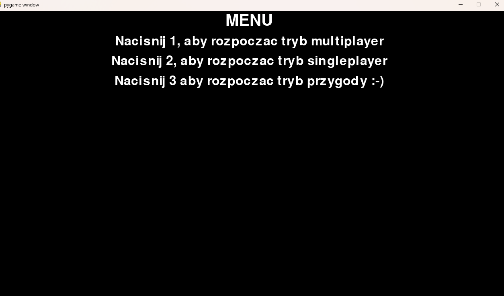
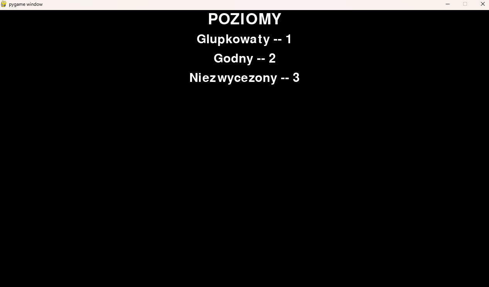
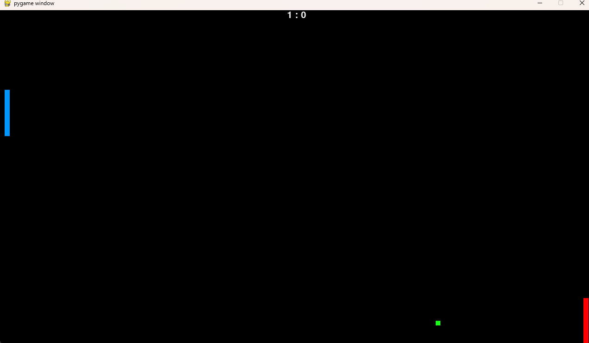
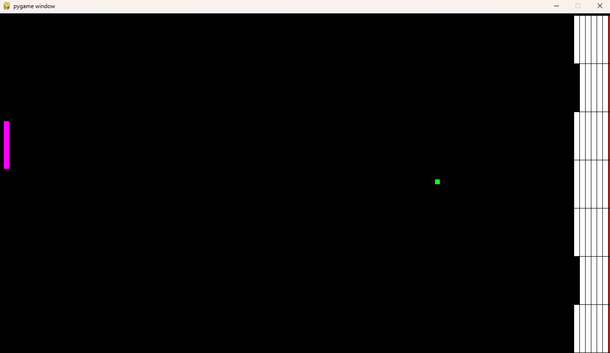

This is a simple pong game made in python with pygame library.

Game itself includes 3 game modes: single player, multiplayer and adventure.

Single player mode consist of three dificulty levels.

In multiplayer game mode one person controls left paddle with [w,s] keys and second player controlls right paddle with arrow keys

Adventure mode involves destroying the blocks on the right side of the screen with a ball

